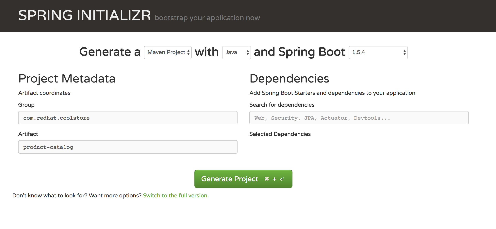

:noaudio:
:scrollbar:
:data-uri:
:toc2:

= Lab 1: Getting Started with Spring and Spring Boot

In this lab, you will learn the basics of Spring development and how to get started with a Spring Boot project. 

== Background

In the past Spring has gotten a lot of criticism for beeing hard to get started with. This has however been addressed by the Spring community with the Spring Boot project and the Spring Initalizer service hosted at http://start.spring.io. However booth Spring Boot and Spring Initalizer takes an opinonated approach to which frameworks and 3rd party library to use. In a similar manner Red Hat provides a service at launch.opeenshift.io that will take an opinionated approach at which frameworks and target platfrom (OpenShift) you are developing for. 

Since this lab aims to teach you have to work with existing Spring application and run it on RHOAR we are going to use the Spring Initalizer. Alternatively we could have used launch.openshift.io or JBoss Forge to initiate the project, however that would have shortcutted some of the steps that are important for your understanding of how to run Spring on RHOAR.

== Contribute
If you find an issue or just a spelling misstake please log a issue at http://github.com/rhoar-enablement/spring, or even better issue a pull request.

= Environment setup

To get started, use `git` to copy the necessary lab files to your local environment:

    $ cd $HOME
    $ mkdir rhoar-enablement
    $ cd rhoar-enablement
    $ git clone https://github.com/rhoar-enablement/spring

This will create a copy of the lab materials in the `spring` subdirectory.

    $ cd $HOME/spring
    $ ls
    lab1 lab2 lab3 lab4 ...

Each lab is self-contained within each of the subdirectories.

NOTE: You can choose any directory to house your lab code, these instructions use `$HOME/rhoar-enablement` as an example.

== Problem solving
If you get stuck during the labs feel free to reach out to your training you can also follow these instructions to find the issue your self.

At the beginning of each lab you will start with working source code, and make modifications yourself to demonstrate
features of the software, ending with working source code that you modified.

If you get stuck and can't figure out why something isn't working or compiling or you are getting strange errors,
you can always compare your project and the contents of the files you are modifying with a pre-created solution
in the `solution` branch of the git repository.

NOTE: You can also just browse the solution in your browser at `https://github.com/rhoar-enablement/spring/tree/solution`

For example, suppose you are on Lab 3 and editing the `pom.xml` file and your build fails. You show the differences
between the "official" solution and YOUR code using:

[source, bash]
% cd $HOME/spring/lab3
% git diff solution:lab3/pom.xml ./pom.xml

To compare the entire source tree between your code and the Lab 3 code:

[source, bash]
% cd $HOME/spring/lab3
% git diff solution:lab3/src ./src

This uses the `git` command line to perform file comparisons using the named branch `solution` and your working
directory of changes. Use the output from `git diff` to see if you've forgotten a step or mis-typed something.

You can also get the entire solution and use that in case you simply want to fast-forward to the end of the lab.
For example, suppose you are stuck on Lab 3 and time is running out, but you want to see the final solution before moving
to lab 4. In this case you can follow these steps:

. If you want to save the changes you've made, run `git stash save`. This will save your changes and then reset your working
directory back to the beginning of the mab.
. Next, run `git checkout solution` to switch to the solution branch. Files in your working directory should now be the solution's files.
. Proceed with the lab (e.g. do a build, run a command, whatever is required in the lab after changing source code)
. When you're done, don't forget to go back to the `master` branch so you can start the next lab at the beginning!
[source, bash]
% git reset --hard
% git checkout master
% git stash apply # optional, only needed if you saved your changes earlier

= Steps

:numbered:

== Initiate the project using Spring Initalizer

1. Open a browser to http://start.spring.io and enter the following information

+
Generate a **Maven project** with **Java** and Spring Boot **1.5.x**
+
[options="header,footer,autowidth"]
|=======
|Attribute|Value
|Group |com.redhat.coolstore
|Artifact |product-catalog
|Dependencies | _Leave Blank_
|=======
+

+
NOTE: The version of Spring is probably different from the picture above. Make sure you use a 1.5.x version.

1. Click Generate project
1. Open a terminal and unzip the downloaded project
+
[source,bash]
----
mkdir -p ~/rhoar-training/spring
cd ~/rhoar-training/spring
unzip ~/Downloads/product-catalog.zip
cp -R product-catalog/* lab1/ 
----

1. Test to build the project  
+
[source,bash]
----
cd lab1
mvn clean package
----

== Create your first Component

1. Create a Java class named `ProductCatalogService` in package `com.redhat.coolstore.productcatalog`

1. Annotate the class with `@Component` and the following import statement `import org.springframework.stereotype.Component`

1. Add a **public** method called `sayHello` returning a `String` like this
+
[source,java]
---- 
public String sayHello() {
    return "Hello World!";
}
----

1. Inject the component into the `ProductCatalogApplicationTests`
+
[source,java]
---- 
@Autowired
ProductCatalogService service
----
+
Note: Autowire annotation requires that you add `import org.springframework.beans.factory.annotation.Autowired;`

1. Add a test method called `testDefaultProudctList`
+
[source,java]
---- 
@Test
public void testDefaultProductList() {
    String message = service.sayHello();
    assertTrue(message!=null);
    assertEquals(message,"Hello World!");
}
----
+
NOTE: This requires that you add the following import statements `import static org.junit.Assert.assertEquals;` and `import static org.junit.Assert.assertTrue;`

1. Run the tests either in your IDE or from commandline like this
+
[source,bash]
----
mvn verify
----

You can now inject a component with @Autowired annotation, similary to how CDI works in Java EE. If you are a Java EE developer you would probably prefer to use the JSR-330 standard annotation `@Inject` instead of `@Autowired` which is also supported by Spring. Let's change the test class to use @Inject instead.

1. Add the following dependency to the `pom.xml` in the `<dependencies>` section.
+
[source,xml]
----
<dependency>
    <groupId>javax.inject</groupId>
    <artifactId>javax.inject</artifactId>
    <version>1</version>
</dependency>
----

1. Change `ProductCatalogApplicationTest` and replace the `@Autowired` with `@Inject` and `import org.springframework.beans.factory.annotation.Autowired;` with `import javax.inject.Inject;`

1. Run the tests either in your IDE or from commandline again and verify that the `@Inject` works.
+
[source,bash]
----
mvn verify
----

== Use environment specific application properties

1. Change the `ProductCatalogService` class and add the following class variable:
+
[source,java]
---- 
@Value("${coolstore.message:Hello World!}")
String message;
----
+
NOTE: The `@Value` annotations namespace is `org.springframework.beans.factory.annotation.Value`

1. Update the `sayHello` class method of `ProductCatalogService` to return the `message` member variable
+
[source,java]
---- 
public String sayHello() {
    return message;
}
----
+

1. Test the change
+
[source,bash]
----
mvn verify
----

=== Add specific message for profile `dev` and update your test to use it
Lets update the test class to use a profile called `dev` that should result in `Hey Developer!` as message

1. Add a new properties file called `src/main/resources/application-dev.properties` with the following content

[source,properties]
----
coolstore.message=Hey Developer!
----

1. Add annotation to `@ActiveProfiles("dev")` to the class `ProductCatalogApplicationTests`

1. Change the `assertEquals` test string to `Hey Developer!`

1. Run the test 
+
[source,bash]
----
mvn verify
----
+
NOTE: This test should fail since we haven't updated the implementation yet.

1. Run the test 
+
[source,bash]
----
mvn verify
----
+
NOTE: This time the test should execute successful

== Add REST capabilities using Apache CXF
At this stage our product catalog service can only say hello and it does not expose any external endpoints. In this section we will add REST support and provide a list of product names. Currently Apache CXF is tested and verified with version 1.4.1 of Spring Boot, so we need to revert to that one. 

NOTE: Because of a bug in Spring 1.5 Apache CXF doesn't work properly. When RHOAR releaes we will probably test and verify towards a more recent version of Spring Boot. 

1. Apache CXF is tested and verfied with version 1.4.1 of Spring Boot, change the `spring-boot-starter-parent` version in the `pom.xml` to `1.4.1.RELEASE`.

1. Also in `pom.xml` add dependencies to Apache CXF as below:
+
[source,xml]
----
<dependency>
    <groupId>org.apache.cxf</groupId>
    <artifactId>cxf-spring-boot-starter-jaxrs</artifactId>
    <version>3.1.10</version>
</dependency>
----

1. Open `ProductCatalogService` and add `@Path("/products")` as class annotation and add the following method
+
[source,java]
----
    @GET
	public Response list() {
		return Response.ok(message,MediaType.APPLICATION_JSON).build();
	}
----
+
NOTE: The `@Path` annotations namespace is `javax.ws.rs.Path`
+
NOTE: The `@GET` annotations namespace is `javax.ws.rs.GET`
+
NOTE: The `Response` class namespace is `javax.ws.rs.core.Response`
+
NOTE: The `MediaType` class namespace is `javax.ws.rs.core.MediaType`

1. Add the following configuration to `src/main/resources/application.properties`
+
[source,properties]
----
cxf.path=/services
cxf.jaxrs.component-scan=true
cxf.jaxrs.classes-scan-packages=com.redhat.coolstore.productcatalog
----

1. Build and run the application
+
[source,bash]
----
mvn spring-boot:run
----

1. Test the endpoint in another terminal using curl
+
[source,bash]
----
curl http://localhost:8080/services/products
----
+
NOTE: The expected output should be `Hello World!`

1. Go back to the original terminal and stop the application using `CTRL-C``

1. Run the application, but this time activate the `dev` profile
+
[source,bash]
----
mvn spring-boot:run -Dspring.profiles.active=dev
---- 

1. Test the endpoint in another terminal using curl
+
[source,bash]
----
curl http://localhost:8080/services/products
----
+
NOTE: The expected output should be `Hey Developer!`

1. Go back to the original terminal and stop the application using `CTRL-C`

=== Add support Jackson JAX-RS binding
Default Apache CXF relies on Jettison 1.3 as JSON provider, but one can also use Jackson provide. Which one to choose is a mater of taste, but Jettison supports only JAXB annotated beans. Since we want to avoid additional annotation or transformation object we are going to use Jackson Provider instead.

1. Add Jackson dependency to the `pom.xml`
+
[source,xml]
----
<dependency>
    <groupId>com.fasterxml.jackson.jaxrs</groupId>
    <artifactId>jackson-jaxrs-json-provider</artifactId>
</dependency>
----

1. Create a configuration class called `ProductCatalogConfiguration` to configure the Jackson using a bean like this:
+
[source,java]
----
package com.redhat.coolstore.productcatalog;

import org.springframework.context.annotation.Bean;
import org.springframework.context.annotation.Configuration;

import com.fasterxml.jackson.databind.ObjectMapper;
import com.fasterxml.jackson.jaxrs.json.JacksonJaxbJsonProvider;
import com.fasterxml.jackson.jaxrs.json.JacksonJsonProvider;

@Configuration
public class ProductCatalogConfiguration {
	
	@Bean
	public JacksonJsonProvider jsonProvider(ObjectMapper objectMapper) {
		JacksonJaxbJsonProvider provider = new JacksonJaxbJsonProvider();
		provider.setMapper(objectMapper);
		return provider;
    }
    
}
----

1. Build and run the application
+
[source,bash]
----
mvn spring-boot:run
----

1. Test the endpoint in another terminal using curl
+
[source,bash]
----
curl http://localhost:8080/services/products
----
+
NOTE: The expected output should be `Hello World!`

= Summary
In this lab you have learned how to create component and how to configure that component for different environments using the configuration api. Then you learned hot to expose the component as a REST service that can be called using standad http protocol. Finally you learned how to add Jackson Json  provider that we are going to be useful in future next labs.

